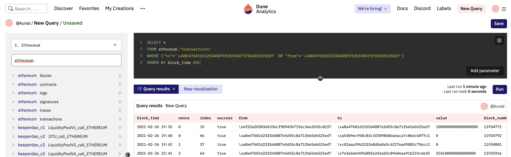
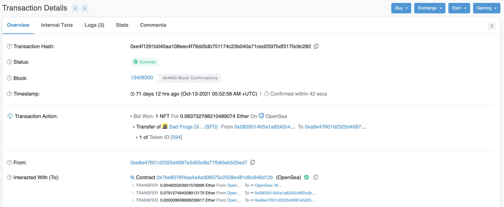
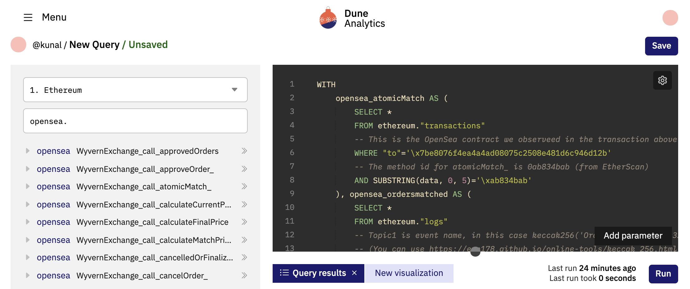

[Dune](https://dune.xyz/browse/dashboards) is an incredibly powerful blockchain analytics tool, though it can be a little daunting to use at first. Let's take a look at how we can query data about OpenSea through Dune.

### A Dune Primer



We can start by creating a [new Dune query](https://dune.xyz/queries). Dune lets you run SQL queries on Ethereum data (along with a few other chains). This lets us query all historical data, but notably doesn't allow fetching data (ie, calling methods in a smart contract) - so unless the data lives in the blockchain, it won't be accessible.

Dune has a huge number of tables accessible, but almost all derive from a few base tables that closely mimic the ethereum data structure: `ethereum."transactions"` (which contains every transaction submitted), `ethereum."logs"` (which contains every log statement), and `ethereum."contracts"`. To find other core eth tables, search for `ethereum.` in the table search on the left.

We can do a quick query for all of my recent transactions (try substituting your wallet address for mine!):
``` sql
SELECT *
FROM ethereum."transactions"
WHERE ("to"='\xA8E47601d2325D4087E5d55C8A71Fb65Eb525Ed7' OR "from"='\xA8E47601d2325D4087E5d55C8A71Fb65Eb525Ed7')
ORDER BY block_time ASC
```
(note: address/transaction hashes start with `\` instead of `0`)

### Understanding OpenSea

Now that we have a handle on Dune, let's figure out the OpenSea transaction flow. We can start with an example OpenSea transaction: Here is a [transaction](https://etherscan.io/tx/0xe4f1291b040aa108eec4f79dd5db751174c23b040a71ced2597bdf3170c9c282) I made earlier this year to buy a Sad Frog (womp womp).



Looking at the transaction details, we see a few interesting details:
1. The transaction calls the contract function `atomicMatch_(address[14] addrs, uint256[18] uints, uint8[8] feeMethodsSidesKindsHowToCalls, bytes calldataBuy, bytes calldataSell, bytes replacementPatternBuy, bytes replacementPatternSell, bytes staticExtradataBuy, bytes staticExtradataSell, uint8[2] vs, bytes32[5] rssMetadata)` (Click "Click to see More" on EtherScan to find this)
2. The transaction emits 3 log events (in the Logs tab): `Transfer`, `Approval`, and `OrdersMatched`. The first two seem like standard token transfer functions (we see these when we transfer ERC20 tokens), but the third one looks custom to this contract.

The `OrdersMatched` function looks very promising! It contains the buyer, seller, and a price. From this event, we should be able to piece together all of the OpenSea transactions. One issue, though, is the price: What currency is it? Does it always correspond to Eth?

Luckily, all of these smart contracts are public, so we can dig in ourselves. We can look at the full, well annotated contract [here](https://github.com/alex-x-crypto/OpenSea-Doc/blob/master/contracts/WyvernExchange.sol). Following the Solidity code, it looks like the price is in terms of the Eth/ERC20 token passed in, but unfortunately that doesn't look to be logged in the `OrdersMatched` function. If we look at the `atomicMatch_` function though, the payment method is in the [long list of addresses](https://github.com/alex-x-crypto/OpenSea-Doc/blob/master/contracts/WyvernExchange.sol#L464-L465) - it's either a contract address, or Eth if empty. Looks like we'll have to do a little extra work to piece these together.

Okay, we have a game plan now: We need to find all of the `OrdersMatched` log events, combine them with `atomicMatch_` calls (on their transaction id, since they happened together), and we should have everything we need.

### Querying OpenSea Data

Starting with the raw tables on Dune (`transactions` & `logs`), we can piece together a query:

``` sql
WITH
    opensea_atomicMatch AS (
        SELECT *
        FROM ethereum."transactions"
        -- This is the OpenSea contract we observeed in the transaction above
        WHERE "to"='\x7be8076f4ea4a4ad08075c2508e481d6c946d12b'
        -- The method id for atomicMatch_ is 0ab834bab (from EtherScan)
        AND SUBSTRING(data, 0, 5)='\xab834bab'
        AND success
    ), opensea_ordersmatched AS (
        SELECT *
        FROM ethereum."logs"
        -- Topic1 is event name, in this case keccak256('OrdersMatched(bytes32,bytes32,address,address,uint256,bytes32)')
        -- (You can use https://emn178.github.io/online-tools/keccak_256.html to calculate it)
        WHERE topic1='\xc4109843e0b7d514e4c093114b863f8e7d8d9a458c372cd51bfe526b588006c9'
    )

SELECT am.data, om.data
FROM opensea_atomicMatch am
JOIN opensea_ordersmatched om
ON (am.hash=om.tx_hash)
```

Unfortunately, parsing the data is going to be a pain, and OpenSea might have multiple contracts (not just the one I hardcoded in here). Luckily, Dune provides pre-parsed tables for events and logs for many popular contracts to make our life much easier. Searching for `opensea.` on Dune's side panel leads us to `opensea."WyvernExchange_call_atomicMatch_"` and `opensea."WyvernExchange_evt_OrdersMatched"` which look like exactly what we want (also, it looks like OpenSea was originally called Wyvern Exchange?).



This leads us to the following query:
``` sql
WITH
    opensea_atomicMatch AS (
        SELECT
            call_tx_hash,
            CASE
                -- From the contract: "a zero-address [is] a sentinel value for Ether"
                -- We can use WETH's smart contract, since it makes our queries a little easier below
                WHEN addrs[7]='\x0000000000000000000000000000000000000000' THEN '\xc02aaa39b223fe8d0a0e5c4f27ead9083c756cc2'
                ELSE addrs[7]
            END AS token_contract
        FROM opensea."WyvernExchange_call_atomicMatch_"
        WHERE call_block_time>='2021-06-01'
    ), opensea_ordersMatched AS (
        SELECT evt_tx_hash, evt_block_time, "maker" AS buyer, "taker" AS seller, "price"
        FROM opensea."WyvernExchange_evt_OrdersMatched"
        WHERE evt_block_time>='2021-06-01'
    )

SELECT om.evt_tx_hash, om.buyer, om.seller
FROM opensea_ordersMatched om
JOIN opensea_atomicMatch am
ON am.call_tx_hash=om.evt_tx_hash
```

Visually inspecting some of the results, we notice a big issue though: There are certain transactions that have multiple atomicMatch_/OrdersMatched calls. [`0x014881ac7...`](https://etherscan.io/tx/0x014881ac74c9624420ae3438aa0fda93d79d66a6a0eb720805cf3927fb10dbff) is an example transaction where GenieSwap trades 30 NFTs in total. Our query above assumed one transaction would have exactly one `atomicMatch_` event; this particular transaction ends up counting as 900 separate rows (30 atomicMatch_ x 30 OrdersMatched), and 30x's the value of the transaction, so we are overcounting the value quite a bit ([query here](https://dune.xyz/queries/312088)).


To fix for that, we can make a couple assumptions to help us:
``` sql
WITH
    opensea_atomicMatch AS (
        SELECT
            -- A single transaction can have multiple transfers, but there is no way to correlate a
            -- particular OrderMatched log line to atomicMatch_ call within the tx.
            -- To deal with this, we make the assumption that a single transaction (of multiple orders) will only
            -- have a single token contract currency.
            -- Here, we use Postgres's nifty DISTINCT ON() syntax, but we could accomplish the same with a GROUP BY
            DISTINCT ON (call_tx_hash) call_tx_hash,
            -- evt/call_block_time corresponds to the time the block that processed this request was mined.
            -- This serves as the timestamp for when the transaction happened.
            call_block_time,
            CASE
                -- From the contract: "a zero-address [is] a sentinel value for Ether"
                -- We can use WETH's smart contract, since it makes our queries a little easier below
                WHEN addrs[7]='\x0000000000000000000000000000000000000000' THEN '\xc02aaa39b223fe8d0a0e5c4f27ead9083c756cc2'
                ELSE addrs[7]
            END AS token_contract,
            addrs[5] AS nft_contract
        FROM opensea."WyvernExchange_call_atomicMatch_"
        -- This will filter out unsuccessful calls
        WHERE call_success
        AND call_block_time>='2021-01-01'
        ORDER BY call_tx_hash, call_block_time DESC
    ), opensea_atomicMatch_prices AS (
        SELECT
            am.call_tx_hash, am.token_contract, am.nft_contract,
            COALESCE(p.decimals, dd.decimals) AS decimals, COALESCE(p.price, dd.median_price) AS price
        FROM opensea_atomicMatch am
        -- Dune has a couple of useful tables to get USD/Token rates
        -- prices."usd" is the easiest to use, but doesn't contain all
        -- contracts. So we can use that, and fall back to dex data.
        LEFT OUTER JOIN prices."usd" p
        ON p.contract_address=am.token_contract
        AND DATE_TRUNC('minute', am.call_block_time)=p.minute
        LEFT OUTER JOIN prices."prices_from_dex_data" dd
        ON dd.contract_address=am.token_contract
        AND DATE_TRUNC('hour', am.call_block_time)=dd.hour
        AND p.price IS NULL
    ), opensea_ordersMatched AS (
        SELECT evt_tx_hash, evt_block_time, "maker" AS buyer, "taker" AS seller, "price"
        FROM opensea."WyvernExchange_evt_OrdersMatched"
        AND evt_block_time>='2021-01-01'
    )

SELECT om.evt_tx_hash, om.buyer, om.seller, am.nft_contract, (om.price / 10^am.decimals) * am.price AS price_usd
FROM opensea_ordersMatched om
JOIN opensea_atomicMatch_prices am
ON am.call_tx_hash=om.evt_tx_hash
```

From this, we can calculate a whole bunch of statistics, like transaction volume and prices.
