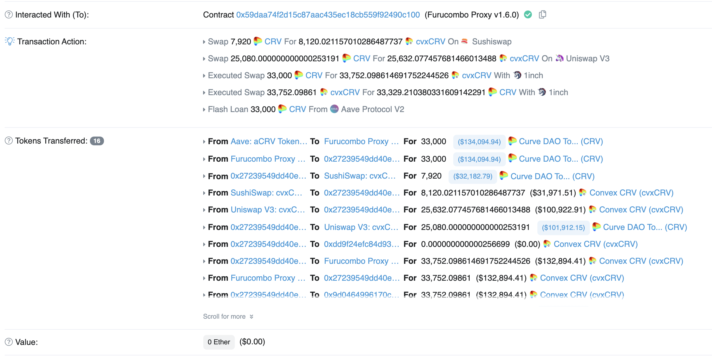
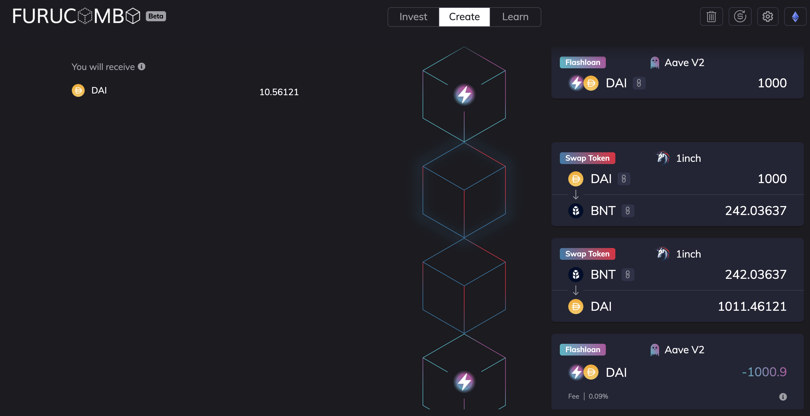

Flashloans are a fascinating DeFi mechanism, where you can get an arbitrarily large uncollateralized loan instantly so long as it is paid back within the same transaction block. If borrower fails to pay back the capital within the block, the entire transaction is reversed, enforcing the lender always gets it's money back (typically with a fixed fee of around 0.09%). The use cases range from arbitrage to self-liquidation. Flashloans have generated a ton of controversy in the past (some notable events: [Flashloan to pass a governance vote on MakerDAO](https://www.theblockcrypto.com/post/82721/makerdao-issues-warning-after-a-flash-loan-is-used-to-pass-a-governance-vote), [a CryptoPunk was "sold" for $500M+](https://decrypt.co/84756/no-someone-didnt-really-pay-532-million-cryptopunk-nft))

To better understand flash loans, let's focus on arbitrage swaps in particular: You can get an large pool of money immediately to execute trades (across token combinations and exchanges), and as long as you make more than 0.09% profit, you'll make money 💰 (of course, you need to factor in gas, which is expensive given how much the transaction is doing 💸).

The first thing to look at is what a successful/profitable flashloan looks like. [Furucombo](https://furucombo.app/) is a popular no-code DeFi transaction builder known for flashloans, so we can start there. The Furucombo smart contract address is [`0x59daa74...`](https://etherscan.io/address/0x59daa74f2d15c87aac435ec18cb559f92490c100), and we can filter down to successful (completed) transactions with 0 Eth in, and manually look for ones with a flashloan (Aave in this case). The first one I saw was [`0x581ed1c16c39...`](https://etherscan.io/tx/0x581ed1c16c39ce72943b6ed88ebbfd5b14a78eceb6ff371b97329cd6dcb2b21c):



There is a lot going on in this transaction (32 logs!), so let's break it down:
1. Flash loan of 33,000 CRV from Aave to Furucombo
2. Swap of 33,000 CRV to 33,752 cvxCRV (1inch routes ~8k through Sushiswap, and the rest through Uniswap)
3. Swap of 33,752 cvxCRV to 33,329 CRV (1inch)
4. Aave receives 33,029.7 CRV (original + 0.09% fee), the executor receives 299.5 CRV (and a little leftover cvxCRV)

The executor started with 0 CRV, and gained 299.5 CRV (~$1200), with a gas fee of 0.132 Eth (~$570). A profitable transaction!

To experiment, I tried using Furucombo's creator. It lets you create, share, and execute transactions with multiple blocks - loans, swaps, staking, etc. In my case, all transactions start with taking a flashloan, and end with paying it back with the same token. Between those, I can do an arbitrary number of actions to maximize the value. A simple example of a 1% arbitrage on `$BNT`:



On the top left, you can see the assets you put in and get out. In this case, I put in nothing and would get 10 DAI back - free money! (the Gas cost at the time was ~$700, so this would have been wildly unprofitable 😂). Due to how [AMMs & liquidity work](https://medium.com/linum-labs/intro-to-bonding-curves-and-shapes-bf326bc4e11a), simply increasing the value of the trades doesn't guarantee you'll multiply the profits accordingly.

It was tedious to try a bunch of combos and see what is profitable. How we can find these profitable pairs automatically?

For fun, we can query the exchange rate of various token pairs to see if we can find some good arbitrage oppurtunities. Since 1inch routes through Uniswap and Sushiswap, 1inch seems like a good place to start. Lucky for us, 1inch provides an official public API: `https://api.1inch.exchange/v3.0/1/quote` with exactly what we need. It also turns out there is a standard template for "lists of tokens", so we can get a variety of interesting seed lists without much work ([Coingecko](https://tokens.coingecko.com/uniswap/all.json), [Yearn](https://yearn.science/static/tokenlist.json), [Gemini](https://www.gemini.com/uniswap/manifest.json)). So all we need to do is look at all pairs of (loaned coin, intermediate coin) and (intermediate coin, loaned coin) to see if there is profit to be had. A more interesting version of this would check across different exchanges, DeFi mechanisms, and consider 2-hop swaps.


I'll skip the implementation details, but you can see a basic script [here](https://github.com/kunalmodi/web3-exploration/tree/master/arbitrage) to identify profitable swaps. Here is the output of running it today:

```
kunal@machine$ ts-node 1inch_swap_arbitrage.ts dai 1000000000000000000000 coingecko
FOUND: DAI -> AMKR (+3.633%) (0x7deb5e830be29f91e298ba5ff1356bb7f8146998)
       1000000000000000000000 -> 362514550640887094-> 1036336433651040195977
...
```

Trying it out in Furucombo, we indeed get a return of 35 DAI (36 - flashloan fee) for a 1000 DAI flashloan investment into AMKR!

Some practical notes:
- This script goes _slowly_ due to rate limits. There are plenty of oppurtunities to speed it up.
- The high percentage differences (>25%) are highly volatile, and it's quite hard to execute on them.
- This doesn't take into gas and routing, which are important factors in determining profitability.
