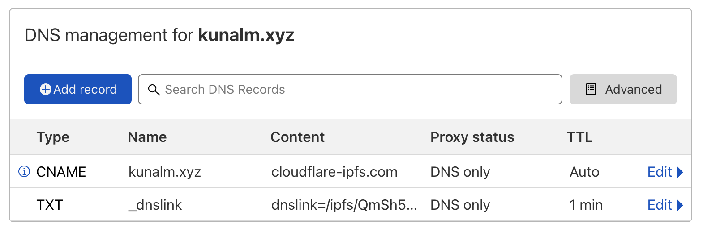
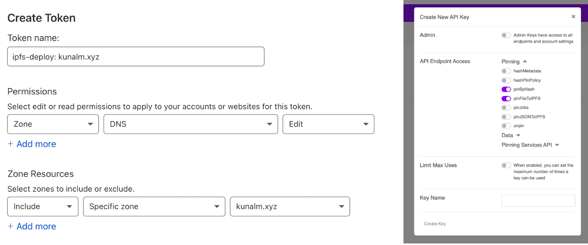

I've been diving into IPFS recently, and took it as an oppurtunity to migrate my blog (this website!) to IPFS. This page can be accessed on your browser via traditional DNS (kunalm.xyz), [IPFS](https://cloudflare-ipfs/ipfs/Qmb98SP1LpgtKcYD96jKEfzd8J5tDHtuoh3oQpLkeWtEXr/), and [IPNS](https://cloudflare-ipfs.com/ipns/_dnslink.kunalm.xyz/).

A little background: [IPFS](https://ipfs.io/) is a peer-to-peer protocol for hypermedia (web content) that is decentralized (think BitTorrent) and versioned/immutable (think Git) - essentially a more open, safe, and auditable way to store files online. For these reasons, IPFS is a core part of Web3 infrastructure - many DApps (like Uniswap) are served from IPFS to prevent tampering and censorship, and NFT metadata is often stored in IPFS.

I won't go into much detail on how IPFS works, but the relevant principles are:
- Content is indexed by a hash of it's content (called a CID). Every change will result in a new CID.
- Any node can advertise that it is hosting the CID content. It's as simple as `ipfs add index.html` to tell the network about a new file, and serve that file to the web.
- Content exists if (and only if) there is a node serving it. While gateways will cache content, at least 1 node needs to host the original file. This is called "pinning" and there are a variety of third party hosts that will do this for you (like [Pinata](https://pinata.cloud), [Infura](https://infura.io/), and [arweave](https://www.arweave.org/)).
- To access IPFS content via HTTP, you need a gateway that can resolve an IPFS url (`ipfs://$CID`). There are a variety of public ones(like cloudflare-ipfs.com and gateway.ipfs.io), and certain applications like [Opera](https://blogs.opera.com/tips-and-tricks/2021/02/opera-crypto-files-for-keeps-ipfs-unstoppable-domains/) support the protocol natively.

With that in mind, the first step is generating an html site.

There are no shortage of static site generators (Hugo, Jekyll, etc.). I use [Eleventy](https://www.11ty.dev/) because it's by far the most simple, but it doesn't matter too much. For the sake of a working example, here is a simple hello world:
```
npm install -g @11ty/eleventy
echo 'Hello World!' > README.md
eleventy
```

This saves an HTML index to the `_site` folder. Opening this (`open _site/index.html`) should open a simple browser window with "Hello World!". Boom, step 1 done! For a more interesting example, you can check out this site's source code [here](https://github.com/kunalmodi/web3-exploration/tree/master/kunalm.xyz).

Second, we need to set up our DNS so our domain will route to IPFS content.

I used Cloudflare as my hosting provider, because their DNS API is easily scriptable (more on that later) and they provide a native gateway (cloudflare-ipfs.com). We need to set our domain to point to Cloudflare's IPFS gateway, so we can set our Root CNAME to `cloudflare-ipfs.com` (Cloudflare automatically [flattens CNAMEs](https://blog.cloudflare.com/introducing-cname-flattening-rfc-compliant-cnames-at-a-domains-root/), on other providers you might need to enter individual A records from `nslookup cloudflare-ipfs.com`). That means our domain now routes to IPFS, but how does Cloudflare know what IPFS CID our website corresponds to? Enter [DNSLink](https://dnslink.io/), which lets us associate a domain/subdomain to an IPFS CID via a TXT record. It works by querying TXT records on `_dnslink.<domain>` to find the relevant IPFS pointer.

To start, we can point to a simple Hello World CID: `Qmd8nEQ2K6Uw67oFjM8FQo6K8qdvkaKMDwN91TBprC7EJ6`. It should look like this:



After the updates propogate, we can check it's set up properly:
```
kunal@machine$ dig -t txt _dnslink.kunalm.xyz +short
"dnslink=/ipfs/Qmd8nEQ2K6Uw67oFjM8FQo6K8qdvkaKMDwN91TBprC7EJ6"
```

Third, we need to deploy our site.

We need to do two things: First, upload our files to IPFS. While we can locally run `ipfs add -r _site/`, we need to ensure it's pinned to an external node so the content doesn't disappear when I turn off my computer. For this, I am using Pinata's to pin my files. Second, we need to update our DNSLink to point to our new CID on every deploy (since it changes every time!).

Luckily, there is a npm library `ipfs-deploy` which handles both of these tasks (and supports other providers as well). We'll need to create API keys for Pinata and Cloudflare. The configuration for reference:



To install:
```
kunal@machine$ npm install -g ipfs-deploy
kunal@machine$ cat .env
IPFS_DEPLOY_PINATA__API_KEY=<enter>
IPFS_DEPLOY_PINATA__SECRET_API_KEY=<enter>
IPFS_DEPLOY_CLOUDFLARE__API_TOKEN=<enter>
IPFS_DEPLOY_CLOUDFLARE__ZONE=kunalm.xyz
IPFS_DEPLOY_CLOUDFLARE__RECORD=_dnslink.kunalm.xyz
```

And to deploy:
```
kunal@machine$ rm -rf _site/ && eleventy && ipfs-deploy _site/ -p pinata -d cloudflare -t "kunalm.xyz $(date +"%m-%d-%Y %T")"
```

Magic! 🧙‍♀️

A note when you add more than one page: Make sure to use relative links (ie, `../img/hello.png` rather than `/img/hello.png`) if you are linking within your site. There are steps for each of the major generators [here](https://developers.cloudflare.com/distributed-web/ipfs-gateway/updating-for-ipfs) for reference.
