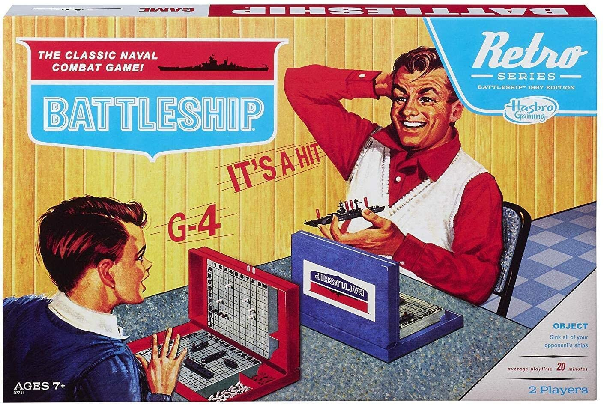
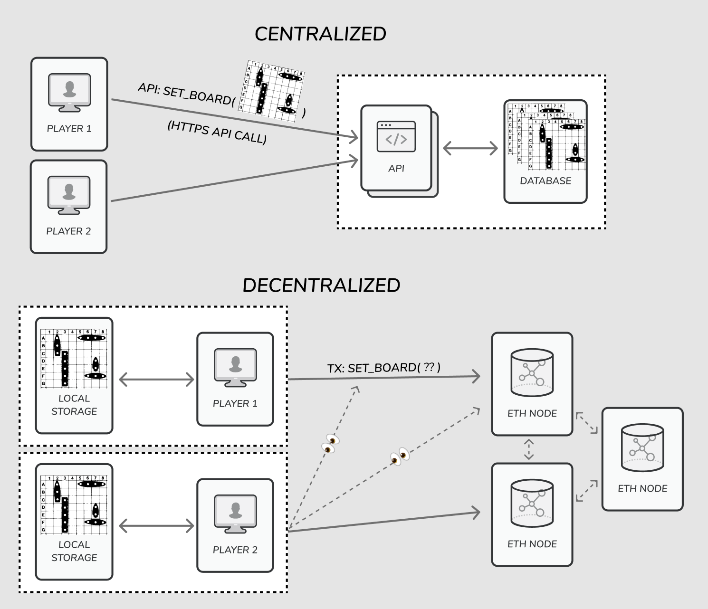
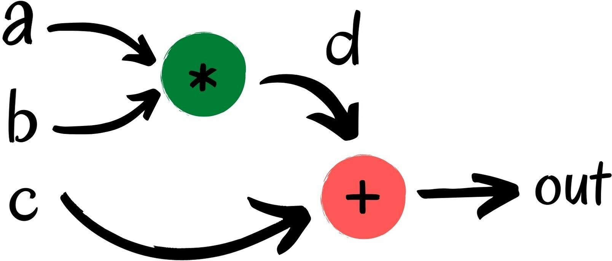
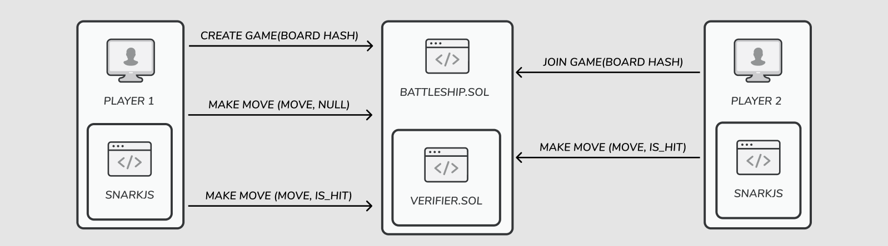

I've been learning about zero knowledge proofs recently, and took it as an oppurtunity to build out a toy use case. This post walks through building a Battleship smart contract using zk-SNARKs, [circom](https://github.com/iden3/circom), [snarkjs](https://github.com/iden3/snarkjs), and Solidity.

As a little background: Zero knowledge proofs let you prove a statement is true without revealing any additional information about the statement. In practice, this might look like showing you are credit worthy without handing over your bank statements, or validating nuclear disarmament without revealing state secrets. Typically, zero knowledge proofs involve repeatedly asking questions in order to validate the statement (see Packy's [great article](https://www.notboring.co/p/zero-knowledge) for an example), but this is infeasible on the blockchain. [zk-SNARK](https://en.wikipedia.org/wiki/Non-interactive_zero-knowledge_proof) is class of zero knowledge proofs that don't require interaction - which makes them a great fit for transactional use cases.

Thinking through the games I've played where you rely on the other player to not cheat, Battleship stood out (who hasn't had an opponent move ships around during the game, or not even place all of their ships on the board!). The rules of battleship are pretty straightforward: Each player places 5 ships on their secret board (ensuring they are non-overlapping), and then players take turn guessing coordinates where their opponent's ships might be. The first person to guess all the coordinates of the other player's ships wins.



You can see the full source code at [https://github.com/kunalmodi/battlesnark](https://github.com/kunalmodi/battlesnark).

### Battleship

Battleship involves trusting your opponent to set up a valid board, and record hits on their ships. Ideally there would be a way for a neutral 3rd party to validate the results without revealing any of the board state to the other player. This guarantees we need for a fair game are:
1. Each player's board is valid
2. Each player's board is unchanged throughout the game
3. A player shouldn't be able to see their opponent's board
4. A player can't lie about whether a guess is a hit or not

Building this in a centralized way is pretty straightforward: A "neutral" webserver/database can store the exact states secretly, and decide the results. As long as you trust the web host, you can trust the results aren't tampered with. Having this work on Ethereum is much more complicated though: Everything in the blockchain (smart contract data, transaction inputs, etc.) is public, so a player can't just send their ship locations in plain text for fear of their opponent seeing it. Let's see how zk-SNARK can help with this.



### zk-SNARK

A zk-SNARK is an arithmetic circuit which takes in a series of numerical signals and constraints, and derives a numerical output and a proof.



There are two types of inputs that make up the circuit:
1. Public Inputs: These are inputs that everyone knows (in Battleship, the guess coordinates are known to both parties so are public)
2. Private Inputs: These are inputs that only the provder knows (in Battleship, the locations of all the ships are private to only 1 player, so should be treated as private)

With a zk-SNARK, you can prove that a set of inputs generates an output, knowing only the public inputs and output. That seems to satisfy our criteria: We want a player to be able to have a private ship configuration, but still verifiably prove whether a public guess is a hit or not.

Based on our requirements above, we need two separate circuits:
1. Board Creation: One that can generate a hash identifiers for a set of ship positions (and validate they are all properly positioned!)
2. Moves: One that can confirm/deny if a guess is a hit or not

To get started, I was looking for a good library to use. While there are a few, the folks at iden3 built `circom` and `snarkjs` with blockchain use cases front and center, so I started with this. [Circom](https://github.com/iden3/circom) is well documented, and has a [great installation/getting started guide](https://docs.circom.io/getting-started). `snarkjs` has a great cli (including a solidity code generator), but was very hard to use in client code. There isn't much consensus on how to use it on the client: [Tornado.cash](tornado.cash) has an [older fork with some useful additions](https://github.com/tornadocash/snarkjs), and iden3 released [`websnark`](https://github.com/iden3/wasmsnark) as a simpler solution (but pretty out of date with the `snarkjs` outputs). I ended up using a slightly hackier solution with the pubic API of `snarkjs`, though I would definitely incorporate a friendlier API for any production use cases.

#### A quick primer on Circom

Circom uses a DSL for writing arithmetic circuits using a Javascript-esque syntax, but with a limited set of operations (all numeric). The base "class" is a component, which has a set of inputs and outputs, and can call into other components.

Translating the circuit diagram above into Circom gives us:

``` js
pragma circom 2.0.0;

template HelloWorld () {  
  signal input a;  
  signal input b;
  signal input c;
  signal output out;  
  signal d;

  assert(a != 1);
  assert(b != 1);
  d <== a * b;
  out <== c + d;
}
component main {public [a, b]} = HelloWorld();
```

To "run" it, we first need to set up a set of inputs. Create a `input.json` in the same directory with contents `{"a": 3, "b": 11, "c": 2}`. With that in place:
``` bash
circom helloworld.circom --wasm
node helloworld_js/generate_witness.js helloworld_js/helloworld.wasm input.json witness.wtns
snarkjs wtns export json
cat witness.json
```

If we inspect `witness.json`, we can see the inputs and outputs. You can try running this with various input parameters (including ones that fail the assertion) to see what happens.

#### Circuit 1: Board Creation

For board creation, we need one private input to represent the position of the ships, and we'll need an output that verifies the hash is based on the positions of the ships.

We can start with the empty circuit:

``` js
pragma circom 2.0.0;

template BattleshipCreate() {
  signal input ships; // Private signal
  signal out; // Public output hash

  // Verify the ship positions are valid

  // Generate a verifiable hash of the ships
  out <-- <hash> // Write the output
}

component main = BattleshipCreate();
```

Verifying the ship positions is pretty straightforward: We need to make sure each ship is within the dimensions of the board and doesn't overlap with any other ship. Generating the hash is a little trickier. Circom itself doesn't provide any hashing functions, but a companion library `circomlib` has a few pre-built circuits we can use: sha256, pedersen, and poseidon. I picked poseidon because it's supposed to be a little more efficient (and perhaps more importantly, the name is a perfect match for our use case).

One issue though: If the hash is unique globally, someone could easily pre-calculate every ship position combination to figure out what your board represents. To deal with that, we introduce a player-specific nonce (secret) to salt the hash with.

First, we'll need to install the library:
``` bash
yarn add circomlib
```

With the library installed, we can reference the circuits with the absolute path to `node_modules/`.

``` js
pragma circom 2.0.0;

include "../node_modules/circomlib/circuits/poseidon.circom";
include "./consts.circom";

template BattleshipCreate() {
  signal input nonce;
  signal input ships[5][3]; // [x,y,direction:0=down,1=right]

  signal output out;

  var boardSize = getBoardSize();
  var lengths[5] = getShipLengths();

  for (var i = 0; i < 5; i++) {
    var len = lengths[i];
    // validate starting position
    // validate boats don't overflow off board
    // validate no overlap
    // Implementation snipped for brevity, you can view the raw code on github
  }

  component poseidon = Poseidon(6); // 6 input numbers
  poseidon.inputs[0] <== nonce;     // First one is our salt. The next 5 are our ship positions
  for (var i = 0; i < 5; i++) {
    // Poseidon takes in a series of numbers, so we want to serialize each ship position as a number.
    // We know a Battleship position is (0...9), so we can store our (x,y,p) array as a 3-digit number
    // ie, [3,2,1] would become "123"
    poseidon.inputs[i+1] <== ships[i][0] + (ships[i][1] * (10 ** 1)) + (ships[i][2] * (10 ** 2));
  }
  out <-- poseidon.out;
}
 a
component main = BattleshipCreate();
```

In addition, we'll need to add an example json input to calculate the witness. Here is an example:
``` json
{
  "nonce": 12345,
  "ships": [[2, 2, 0], [4, 0, 1], [1, 0, 0], [5, 5, 1], [6, 3, 0]]
}
```

Notice that if we compile the circuit with an invalid state input, the compilation process will throw an error. We can also verify that running the circuit with different nonces results in different output hashes. Boom!

#### Circuit 2: Moves

The circuit for verify moves is similar, with a couple of additions:
1. We have a mix of public and private inputs now
2. We need to verify that the ships match the poseidon hash generated from the circuit above

The completed circuit looks like:
``` js
pragma circom 2.0.0;

include "../node_modules/circomlib/circuits/poseidon.circom";
include "./consts.circom";

function isMatch(guess, ship, len) {
  if (ship[2] == 0) { // Down
    return
      guess[0] == ship[0] &&
      guess[1] >= ship[1] &&
      guess[1] <  ship[1] + len;
  } else { // Right
    return
      guess[1] == ship[1] &&
      guess[0] >= ship[0] &&
      guess[0] <  ship[0] + len;
  }
}

template BattleshipMove() {
  // Public Inputs:
  signal input boardHash;
  signal input guess[2]; // [x,y]
  // Private Inputs:
  signal input nonce;
  signal input ships[5][3]; // [x,y,direction]

  signal output isHit;

  var boardSize = getBoardSize();
  var lengths[5] = getShipLengths();

  // 1. validate the guess is actually valid
  assert(guess[0] >= 0 && guess[0] < boardSize);
  assert(guess[1] >= 0 && guess[1] < boardSize);

  // 2. validate the inputted ships matches the public hash (the player isn't cheating!)
  // (note that the way we populate this has to be exactly the same as how we generate it above)
  component poseidon = Poseidon(6);
  poseidon.inputs[0] <== nonce;
  for (var i = 0; i < 5; i++) {
    poseidon.inputs[i+1] <== ships[i][0] + (ships[i][1] * (10 ** 1)) + (ships[i][2] * (10 ** 2));
  }
  assert(boardHash == poseidon.out);

  // 3. check if it's a hit
  isHit <-- (
    isMatch(guess, ships[0], lengths[0]) ||
    isMatch(guess, ships[1], lengths[1]) ||
    isMatch(guess, ships[2], lengths[2]) ||
    isMatch(guess, ships[3], lengths[3]) ||
    isMatch(guess, ships[4], lengths[4])
  );
}

component main {public [boardHash, guess]} = BattleshipMove();
```

Here is an example input that will be a hit:
``` json
{
  "boardHash": "16197009954397410987850071154227578181415795060973153034683682481382492436971",
  "nonce": 12345,
  "guess": [1, 2],
  "ships": [[2, 2, 0], [4, 0, 1], [1, 0, 0], [5, 5, 1], [6, 3, 0]]
}
```

#### Compilation

The process for compiling circuits and the ceremony for generating a witness is pretty interesting: the `circom` [instructions](https://docs.circom.io/getting-started/computing-the-witness/) explain it well. You can take a look at our [build script](https://github.com/kunalmodi/battlesnark/blob/master/scripts/circuits.sh) as well for how to wrap these instructions in a script.

After compiling, we have a few output files we care about:
1. `contracts/createVerifier.sol` and `contracts/moveVerifier.sol`. These are ready-to-deploy (note that `snarkjs` is still stuck on a very old version of Solidity; I manually updated the Solidity version in the build script, but there are a few tasks to modernize these)
2. `circom/*/*_0001.zkey`, `circom/*/verification_key.json`, and `circom/*/*_js/witness_calculator`. These three files will be necessary for clients to generate proofs (and correspond to the Solidity code outputted)

### Smart Contract

Now that we have our circuits and Verifier programs built, we can start building the actual game logic. I used [`hardhat`](hardhat.org) to set up my environment to make testing and deploying easy:
``` bash
yarn add hardhat
yarn hardhat init
```

The `circom` output is a Solidity file that can be deployed directly to the blockchain. As a result, we'll just need to pass the address of each of these contracts to our game contract so it knows which contract to call. The input to these functions is pretty complicated though... that's 8 different parameters corresponding to our zk-SNARK proof. To simplify our public ABI, we use a single `bytes _proof` parameter to represent the proof. In our solidity code, we can split this string into a `uint256[8]` manually with `abi.decode(_proof, (uint256[8]));` to call into our functions.

``` json
pragma solidity ^0.8.0;

interface ICreateVerifier {
  // Copied from createVerifier's public ABI
  function verifyProof(
    uint[2] memory a,
    uint[2][2] memory b,
    uint[2] memory c,
    uint[1] memory input
  ) external returns (bool);
}

interface IMoveVerifier {
  // Copied from createVerifier's public ABI
  function verifyProof(
    uint[2] memory a,
    uint[2][2] memory b,
    uint[2] memory c,
    uint[4] memory _input
  ) external returns (bool);
}

contract Battleship {
  ICreateVerifier public immutable createVerifier;
  IMoveVerifier public immutable moveVerifier;

  constructor(
    ICreateVerifier _createVerifier,
    IMoveVerifier _moveVerifier
  ) {
    createVerifier = _createVerifier;
    moveVerifier = _moveVerifier;
  }

  ...
}
```

With that set, we define the exact transaction flow. 
- `createGame`: A player calls this to create a new `Game` object, and submits a hash of their (secret) board along with a proof to validate it.
- `joinGame`: A player call this to join an existing Game, and similarly submits a hash of their secret board and a proof to validate it. We save both player's hashes in Solidity, to ensure they aren't changed throughout the game.
- `makeMove`: A player calls this to declare they are targeting a particular square. To make a new move, the player has to also share the result of their opponent's previous move (hit or not hit).



Putting all of that together gives us the following contract:

``` json
pragma solidity ^0.8.0;

interface ICreateVerifier { ... }

interface IMoveVerifier { ... }

contract Battleship {
  ICreateVerifier public immutable createVerifier;
  IMoveVerifier public immutable moveVerifier;

  struct Move {
    uint x;
    uint y;
    bool isHit;
  }

  struct Game {
    address player1;
    address player2;
    uint256 player1Hash;
    uint256 player2Hash;
    mapping(uint => Move) moves;
    uint movesSize;
  }

  uint32 nextGameID;
  mapping(uint32 => Game) games;

  constructor(
    ICreateVerifier _createVerifier,
    IMoveVerifier _moveVerifier
  ) {
    createVerifier = _createVerifier;
    moveVerifier = _moveVerifier;
  }

  function requireCreateProof(
    bytes calldata _proof,
    uint256 _boardHash
  ) internal {
    uint256[8] memory p = abi.decode(_proof, (uint256[8]));
    require(
      createVerifier.verifyProof(
        [p[0], p[1]],
        [[p[2], p[3]], [p[4], p[5]]],
        [p[6], p[7]],
        [_boardHash]
      ),
      "Invalid board state (ZK)"
    );
  }

  function requireMoveProof(
    bytes calldata _proof,
    uint256 _boardHash,
    bool isHit,
    uint x,
    uint y
  ) internal {
    uint256[8] memory p = abi.decode(_proof, (uint256[8]));
    require(
      moveVerifier.verifyProof(
        [p[0], p[1]],
        [[p[2], p[3]], [p[4], p[5]]],
        [p[6], p[7]],
        [isHit ? 1 : 0, _boardHash, x, y]
      ),
      "Invalid move (ZK)"
    );
  }

  function createGame(
    bytes calldata _proof,
    uint256 _boardHash
  ) external returns (uint32) {
    requireCreateProof(_proof, _boardHash);

    uint32 _currentID = nextGameID;
    nextGameID += 1;

    Game storage g = games[_currentID];
    g.player1 = msg.sender;
    g.player1Hash = _boardHash;
    g.movesSize = 0;

    return _currentID;
  }

  function joinGame(
    uint32 _gameID,
    bytes calldata _proof,
    uint256 _boardHash
  ) external {
    require(_gameID >= 0 && _gameID < nextGameID, "Invalid Game ID");
    Game storage g = games[_gameID];

    require(g.player1 != msg.sender, "Not allowed to join your own game");
    require(g.player2 == address(0), "Game is full");

    requireCreateProof(_proof, _boardHash);

    g.player2 = msg.sender;
    g.player2Hash = _boardHash;
  }

  function submitMove(
    uint32 _gameID,
    uint _moveX,
    uint _moveY,
    bytes calldata _proof,
    bool isPreviousMoveAHit
  ) external {
    require(_gameID >= 0 && _gameID < nextGameID, "Invalid Game ID");
    Game storage g = games[_gameID];

    uint256 _boardHash = g.player1Hash;
    if (g.movesSize % 2 == 0) {
      require(msg.sender == g.player1, "Not your turn!");
    } else {
      require(msg.sender == g.player2, "Not your turn!");
      _boardHash = g.player2Hash;
    }

    require(_moveX >= 0 && _moveX < 10, "Invalid Move (X)");
    require(_moveY >= 0 && _moveY < 10, "Invalid Move (Y)");

    // For the not-first move, ensure the previous guess is marked as hit/no-hit
    if (g.movesSize > 0) {
      Move storage previousMove = g.moves[g.movesSize - 1];
      requireMoveProof(_proof, _boardHash, isPreviousMoveAHit, previousMove.x, previousMove.y);
      previousMove.isHit = isPreviousMoveAHit;
      // TODO: Handle winning / ending the game!
    }

    g.moves[g.movesSize] = Move({x: _moveX, y: _moveY, isHit: false});
    g.movesSize += 1;
  }
}
```

### Testing

The final step is testing! Instead of building a React frontend, I opted to use hardhat's tests to simulate the flow on the local hardhat network. The hardest part, by far, was figuring out how to actually run the proof outside of Solidity. The circom command's `--wasm` flag generates a witness calculator for us, so we can plug that in manually (though sadly it's not typed, and it's a little fuzzy what the inputs are). The proof generation ends up look like:

``` js
const snarkjs = require('snarkjs')
const fs = require('fs')
const createWC = require('../circom/create/create_js/witness_calculator.js');
const createWasm = './circom/create/create_js/create.wasm'
const createZkey = './circom/create/create_0001.zkey'
const WITNESS_FILE = '/tmp/witness'

const genCreateProof = async (input: any) => {
  const buffer = fs.readFileSync(createWasm);
  const witnessCalculator = await createWC(buffer);
  const buff = await witnessCalculator.calculateWTNSBin(input);
  // The package methods read from files, so we just shove it in /tmp/...
  fs.writeFileSync(WITNESS_FILE, buff);
  const { proof, publicSignals } = await snarkjs.groth16.prove(createZkey, WITNESS_FILE);
  const solidityProof = proofToSolidityInput(proof);
  return { solidityProof: solidityProof, inputs: publicSignals };
}
```

Remember above, how we said we would pass around the proof as a single string instead of 8 separate fields? That's what `proofToSolidityInput` does:

``` js
const proofToSolidityInput = (proof: any): string => {
  const proofs: string[] = [
    proof.pi_a[0], proof.pi_a[1],
    proof.pi_b[0][1], proof.pi_b[0][0],
    proof.pi_b[1][1], proof.pi_b[1][0],
    proof.pi_c[0], proof.pi_c[1],
  ];
  const flatProofs = proofs.map(p => bigInt(p));
  return "0x" + flatProofs.map(x => toHex32(x)).join("")
}
const toHex32 = (num: number) => {
  let str = num.toString(16);
  while (str.length < 64) str = "0" + str;
  return str;
}
```

(This methodology is shamelessly copied from Tornado Cash's contract implementation).

With that in place, we can write our test case in a pretty standard way (check [here](https://github.com/kunalmodi/battlesnark/blob/master/test/index.ts) for the full code): 

``` js
const player1Create = {
  "nonce": 12345,
  "ships": [[2, 2, 0], [4, 0, 1], [1, 0, 0], [5, 5, 1], [6, 3, 0]],
};

const player2Create = {
  "nonce": 23456,
  "ships": [[2, 2, 0], [4, 0, 1], [1, 0, 0], [5, 5, 1], [6, 3, 0]],
};

describe("Battleship", function () {
  it("Should play properly", async function () {
    const [account1, account2] = await ethers.getSigners();

    // 1. Deploy Everything
    const CreateVerifier = await ethers.getContractFactory("contracts/createVerifier.sol:Verifier");
    const createVerifier = await CreateVerifier.deploy();
    await createVerifier.deployed();
    const MoveVerifier = await ethers.getContractFactory("contracts/moveVerifier.sol:Verifier");
    const moveVerifier = await MoveVerifier.deploy();
    await moveVerifier.deployed();
    const Battleship = await ethers.getContractFactory("Battleship");
    const battleship = await Battleship.deploy(createVerifier.address, moveVerifier.address);
    await battleship.deployed();
  
    // 2. Player 1 starts the game
    const proof1 = await genCreateProof(player1Create);
    await battleship.connect(account1).createGame(proof1.solidityProof, proof1.inputs[0]);

    // 3. Player 2 joins the game
    const proof2 = await genCreateProof(player2Create);
    await battleship.connect(account2).joinGame(0, proof2.solidityProof, proof2.inputs[0]);

    // 4. Player 1 submits a move (since there is no previous move, no proof)
    await battleship.connect(account1).submitMove(0, 1, 2, emptyProof, false);

    // 5. Player 2 submits a move (since there is a previous move, proof required)
    const game = await battleship.game(0);
    const prevMove = game.moves[1];
    const proof3 = await genMoveProof({
      'boardHash': game.player2Hash.toString(),
      'guess': [prevMove.x.toNumber(), prevMove.y.toNumber()],
      'nonce': player2Create.nonce,
      'ships': player2Create.ships,
    });
    await battleship.connect(account2).submitMove(0, 0, 0, proof3.solidityProof, true);
  });
});
```